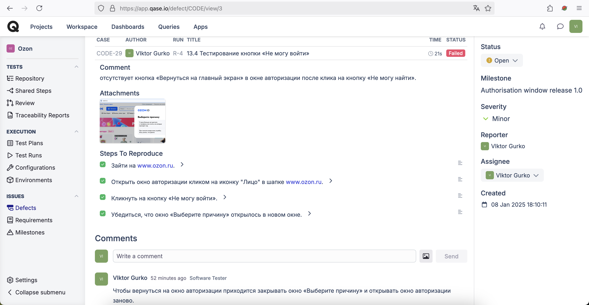

# Ozon and Ozon Travel

## Table of Contents

1. [Project Description](#project-description)
2. [Types of Testing Covered in the Project](#types-of-testing-covered-in-the-project)
3. [Web Application Actions](#web-application-actions)
4. [Demo of Test Automation on YouTube](#demo-of-test-automation-on-youtube)
5. [Test Execution](#test-execution)
6. [Test Suites for Ozon and Ozon Travel](#test-suites-for-ozon-and-ozon-travel)
   - [Test Suite “tests” for Ozon](#test-suite-tests-httpswwwozonru)
     - [Smoke Test — Purchase Function Check](#smoke-test--purchase-function-check)
     - [Icon Color Change on Hover: “Order List” Button](#icon-color-change-on-hover-order-list-button)
     - [Cart Total Calculation with Ozon Card](#cart-total-calculation-with-ozon-card)
     - [Popup Notification Check](#popup-notification-check)
     - [Dropdown Menu of Profile Button](#dropdown-menu-of-profile-button)
     - [Cookies Functionality Check](#cookies-functionality-check)
     - [Page Attribute Retrieval](#page-attribute-retrieval)
     - [Performance Testing](#performance-testing)
     - [Performance Testing with Extension Enabled](#performance-testing-with-extension-enabled)
     - [Accessibility Testing](#accessibility-testing)
     - [Localization Testing](#localization-testing)
     - [Test Session Based on “Hesitant Buyer” Tour](#test-session-based-on-hesitant-buyer-tour)
   - [Test Suite “tests.authorisation” for Ozon](#test-suite-testsauthorisation-httpswwwozonru)
     - [Authorization Modal Window](#authorization-modal-window)
       - [Phone Number Input Field Testing](#phone-number-input-field-testing)
         - [Checklist](#checklist-131)
         - [Test Cases](#1311-enter-a-valid-phone-number-9999999999)
       - [Country Code Dropdown Testing](#country-code-dropdown-testing)
       - [Login via Gosuslugi](#login-via-gosuslugi)
       - [“Can't Log In” Button Testing](#cant-log-in-button-testing)
       - [“X” Close Button Testing](#x-close-button-testing)
       - [“Log In via Email” Modal Window](#log-in-via-email-modal-window)
         - [“Back to Main Screen” Button](#back-to-main-screen-button)
         - [“Can't Log In” Button Testing](#cant-log-in-button-testing)
         - [“X” Close Button Testing](#x-close-button-testing)
         - [Email Input Field Testing](#email-input-field-testing)
           - [Checklist](#checklist-1364)
           - [Test Cases](#13641-clear-email-input-button-x)
   - [Test Suite “tests.ozon_travel_search” for Ozon Travel](#test-suite-testsozon_travel_search-httpswwwozonrutravel)
     - [Smoke Test for Ticket Search Functionality](#smoke-test-for-ticket-search-functionality)
       - [Positive Test](#positive-test)
       - [Negative Test](#negative-test)
7. [Bug Report](#bug-report)
8. [Bug Fix Testing Plan](#bug-fix-testing-plan)
9. [Test Execution Report](#test-execution-report)
10. [Test Management](#test-management)

## Project Description

This project is a working example of 54 automated UI and API tests for the Google Chrome browser. The tests are developed using object-oriented programming (OOP) and are based on test suites, state transition tables, traceability matrices, and test sessions for the websites [www.ozon.ru](https://www.ozon.ru) and [www.ozon.ru/travel](https://www.ozon.ru/travel).

The project follows the Page Object Model (POM) design pattern. The following tools and technologies were used during development:

- Programming languages: Python and JavaScript scripts.
- Libraries and frameworks: Selenium WebDriver, Requests.
- Modules: `time`, `os`, `pickle`.
- Additional tools: Allure for reporting and the JavaScript debugger for analyzing and inspecting complex UI elements.

### Key Aspects:

1. The project demonstrates a general understanding of core web application testing principles:
   - Equivalence classes.
   - Boundary value analysis.
   - State transition tables.
   - Test tours.
   - Pairwise testing.
   - Traceability matrices.
   - Bug fix verification.

2. The implementation demonstrates the required level of proficiency in Python with JavaScript script integration and the use of the Selenium framework to automate most test scenarios.

### Features of Test Cases and Code Comments:

- Expected outcomes for each step of the test cases are grouped into a common expected result stated in the test case titles.
- Code comments serve technical documentation purposes and describe the structure and interaction between components; they are not intended as educational material.

### Test Management and Reporting:

- The QASE platform (https://qase.io/) is used for test management and bug tracking.
- A demo presentation of the project is available on YouTube: https://youtu.be/tzbQx5w7iiw
- Allure is used for generating test reports.
- A demo of the Allure report is available on YouTube: https://youtu.be/-hOcluoH_RM

## Types of Testing Covered in the Project

1. By test object.
2. Functional testing.
3. Smoke testing.
4. Regression testing.
5. Exploratory testing.
6. Performance testing.
7. Usability UI testing.
8. Security testing.
9. Localization testing.
10. Accessibility testing.
11. Compatibility testing.
12. Caching testing.

## Web Application Actions

The project implements automation of nearly all possible interactions with the website that a user can perform through visible UI elements:

- Scrolling the page  
- Refreshing the page  
- Navigating through browser history (back/forward)  
- Working with multiple tabs and switching between them  
- Interacting with input fields  
- Keyboard actions  
- Working with checkboxes  
- Working with radio buttons  
- Hovering over elements  
- Handling dropdown menus  
- Interacting with browser extensions  
- Managing cookies  
- Extracting page data (URL, HTML code, title, class, id, attribute values)  
- Working with embedded HTML pages (iframes)

## Demo of Test Automation on YouTube

Link to the playlist with demo examples:  
https://www.youtube.com/playlist?list=PL_MUMhbrEE--54W-B4TaaeVRv7Zy8scmH

Videos presented in the playlist:

1. [Test Case 6](#6-cookies-functionality-check) — Testing cookies functionality on Ozon.  
2. [Test Case 12](#12-test-session-based-on-hesitant-buyer-tour) — Test session based on the "Hesitant Buyer" tour on Ozon.  
3. [Test Case 13.4](#134-cant-log-in-button-testing) — Testing the "Can't Log In" button (bug found) on Ozon.  
4. [Test Cases 13.6.4.9 – 13.6.4.18](#13649-enter-a-valid-email-with-space-inside-w-wwww) — Email input field testing on Ozon.  
5. [Test Case 14.1](#141-positive-test) — Smoke test for ticket search functionality on Ozon Travel.  
6. [Test Execution Report](#test-execution-report)  
7. [Test Management](#test-management)

## Test Execution

### Local Execution Requirements:

1. Google Chrome browser  
2. Any IDE capable of running Python code  
3. Python virtual environment (venv)  
4. Selenium  
5. Webdriver_manager  
6. Requests  
7. Allure

### Possible Test Failures and Their Causes:

1. **Unstable internet connection.**  
   This can result in `NoSuchElementException`. In such cases, increase `time.sleep` delays to allow page elements to fully load.

2. **Frequent updates to ozon.ru and ozon.ru/travel.**  
   Element indexing may change at any moment, which can also trigger `NoSuchElementException`.  
   The test logs will indicate which element failed to be indexed. You can update the locator in the `locators.py` file inside the `Locators` directory.

3. **Test #9 requires a Chrome browser extension in `.crx` format.**  
   To run it successfully, download any `.crx` extension (e.g., AdBlock.crx) into the `Path/Tests/extensions` directory.  
   If no `.crx` file is present, the test will fail with `OSError: Path to the extension doesn't exist`.

## Test Suites for Ozon and Ozon Travel

**Precondition for all test suites:** the user is not logged in.

**Contents of test suites:**

1. `tests` (tests 1–12) — 12 test cases covering various scenarios.  
2. `tests.authorisation` (test 13) — checklists and test cases for the Ozon authorization modal window.  
3. `tests.ozon_travel_search` (test 14) — test cases for the Ozon Travel ticket booking feature.

### 1. Test Suite “tests” ([https://www.ozon.ru/](https://www.ozon.ru/))

#### 1. Smoke Test — Purchase Function Check

**Goal:** Purchase any item in any quantity from the main page.

**Expected Result:** The item is successfully added to the cart, but upon attempting to proceed to checkout, the user is redirected to the authorization page.

**Reproduction Steps:**

1. Open [www.ozon.ru](https://www.ozon.ru)  
2. Scroll down to the “Bestsellers” category  
3. Click on the first product  
4. On the product detail page, click the “Buy in one click” button. The browser is redirected to the login page in the current tab  
5. Verify that the login page is displayed

#### 2. Icon Color Change on Hover: “Order List” Button

**Goal:** Test the color change of the “Order List” icon in the header when hovered over with the mouse.

**Expected Result:** When hovering over the “Order List” icon, its color should change.

**Reproduction Steps:**

1. Open [www.ozon.ru](https://www.ozon.ru)  
2. Hover the mouse over the “Order List” icon in the header  
3. Verify that the icon's color has changed

#### 3. Cart Total Calculation with Ozon Card

**Goal:** Test correct calculation of the order total with the Ozon Card in the cart.

**Entry Criteria:** Add 2 products from the homepage to the cart, each in a quantity greater than 1.

**Expected Result:**  
The total price with the Ozon Card for all units of product 1 plus all units of product 2 should equal the cart’s final total with the Ozon Card.

**Reproduction Steps:**

1. Open [www.ozon.ru](https://www.ozon.ru)  
2. Scroll down to the “Bestsellers” category  
3. Click on the first product (opens in a new tab)  
4. Click on the second product (also opens in a new tab)  
5. On the first product page, click “Add to cart” with quantity >1 and wait for the “Go to cart” button to appear  
6. On the second product page, click “Add to cart” with quantity >1 and wait for the “Go to cart” button  
7. Click “Go to cart” (redirects to the cart page)  
8. Compare the combined price with the Ozon Card for both products to the final total in the cart  
9. Verify that the values match

#### 4. Popup Notification Check

**Goal:** Test the proper appearance and dismissal of the cookie notification on the homepage in the bottom-right corner.

**Expected Result:** The cookie notification appears, and after clicking the “OK” button, it disappears.

**Reproduction Steps:**

1. Open [www.ozon.ru](https://www.ozon.ru)  
2. Wait for the cookie notification to appear in the bottom-right corner  
3. Click the “OK” button in the notification  
4. Verify that the notification disappears

#### 5. Dropdown Menu of Profile Button

**Goal:** Check the functionality of the dropdown menu of the profile button (represented by a face icon) and the activity of all elements within the dropdown.

**Expected Result:**  
When hovering over the “face” icon, a dropdown menu should appear with two buttons: “Log In or Register” and “Personal Account”.  
- Clicking “Log In or Register” opens a non-blocking modal registration window on the current page.  
- Clicking “Personal Account” redirects the user to the personal account page.

**Reproduction Steps:**

1. Open [www.ozon.ru](https://www.ozon.ru)  
2. Click “OK” on the cookie notification  
3. Hover over the “face” icon in the top right corner of the header  
4. Verify that a dropdown appears with buttons: “Log In or Register” and “Personal Account”

#### 6. Cookies Functionality Check

**Goal:** Test cookie functionality when adding two products to the cart by clearing and restoring the browser’s cookie history.

**Expected Result:**  
After adding two different products to the cart and deleting cookies, the items should disappear.  
After restoring the cookies, the same items (with the same quantity) should return to the cart.

**Reproduction Steps:**

1. Open [www.ozon.ru](https://www.ozon.ru)  
2. Scroll down to the “Bestsellers” category  
3. Click the first product (opens in a new tab)  
4. Click the second product (opens in a new tab)  
5. On the first product page, click “Add to cart” with quantity >1 and wait for the “Go to cart” button  
6. On the second product page, do the same  
7. Click “Go to cart” (redirects to the cart page)  
8. Download all cookies from the cart page  
9. Delete all cookies from the cart page  
10. Refresh the cart page  
11. Verify that cookies were removed and the cart is empty  
12. Restore previously saved cookies on the cart page  
13. Refresh the page again  
14. Verify that the cookies were restored and the same two items reappear in the cart

**Demo:** [https://youtu.be/rJh4BuF2QLo](https://youtu.be/rJh4BuF2QLo)

#### 7. Page Attribute Retrieval

**Goal:** Retrieve attributes to identify the current page [www.ozon.ru](https://www.ozon.ru) (URL and title), and save the HTML code of the loaded part of the page into a separate file.

**Expected Result:**  
The current page is opened, and an HTML file of the page content is saved into a designated directory.

**Reproduction Steps:**

1. Open [www.ozon.ru](https://www.ozon.ru)  
2. Verify the correctness of the current page URL  
3. Verify the correctness of the current page title  
4. Save the HTML code of the current page into a separate directory  
5. Confirm that the file has been saved

#### 8. Performance Testing

**Goal:** Measure the time elapsed between sending the first byte of a request to [www.ozon.ru](https://www.ozon.ru) and completing the parsing of response headers.

**Expected Result:**  
The time interval between request sent and response received is recorded.

**Reproduction Steps:**

1. Open [www.ozon.ru](https://www.ozon.ru)  
2. Confirm that the time interval between request and response has been captured

#### 9. Performance Testing with Extension Enabled

**Goal:** Measure the time elapsed between sending the first byte of a request to [www.ozon.ru](https://www.ozon.ru) and completing the parsing of response headers, while a browser extension is active.

**Expected Result:**  
The time interval is successfully recorded under browser conditions with an extension enabled.

**Reproduction Steps:**

1. Install any browser extension (e.g., AdBlock)  
2. Enable the extension  
3. Open [www.ozon.ru](https://www.ozon.ru)  
4. Capture the time interval between sending the request and receiving the response

#### 10. Accessibility Testing

**Goal:** Verify that clicking the “For the visually impaired” button in the footer redirects to the accessibility version of the website.

**Expected Result:**  
After clicking the “For the visually impaired” button, the user is redirected to the accessibility version of the page.

**Reproduction Steps:**

1. Open [www.ozon.ru](https://www.ozon.ru)  
2. Dismiss any pop-up notifications about geolocation and cookies  
3. Scroll to the bottom of the page  
4. In the footer (bottom right), click the “For the visually impaired” button  
5. Verify that the accessibility version of the website is opened

#### 11. Localization Testing

**Goal:** Verify that clicking the currency switch button labeled “RUB” in the header opens a non-blocking modal window with a dropdown list of currencies, and selecting “US Dollar” changes the currency to USD on the website.

**Expected Result:**  
After clicking the “RUB” button, a currency selection window appears, and upon selecting “US Dollar,” the website’s currency changes to USD.

**Reproduction Steps:**

1. Open [www.ozon.ru](https://www.ozon.ru)  
2. Click the “RUB” button in the header  
3. In the modal window with the currency dropdown, select “US Dollar (USD)”  
4. Verify that the currency on the site has changed to USD

#### 12. Test Session Based on “Hesitant Buyer” Tour

**Tour Description:**  
This test tour is designed with the specifics of the site and likely user behavior in mind. The user doesn’t just select filters once, add an item to the cart, and proceed to checkout — instead, they change filters, cancel actions, and explore multiple options. The goal is both to stress-test the application and to cover various functionalities at once.

**Goal:**  
Add a product to the cart — specifically, an original Xiaomi robot vacuum cleaner with a container or aqua filter in the mid-price range — after applying and changing multiple filters.

**Expected Result:**  
The item is successfully added to the cart. When attempting to proceed to checkout, the user is redirected to the authorization page.

**Reproduction Steps:**

1. Open [www.ozon.ru](https://www.ozon.ru)  
2. In the search bar at the top, type “пылесос” (vacuum cleaner) and press `Enter`. This leads to the product catalog with the search results. Filters appear on the left  
3. In the “Category” filter, select “Robot Vacuums”. The filter is applied immediately  
4. From the list of results, click the image of the first item. The product detail page opens in a new tab  
5. Click the “Go to Description” button on the right side of the image  
6. Click the “Add to cart” button and wait for the “Go to cart” button to appear  
7. Click the “Go to cart” button. The cart page opens in the current tab  
8. On the cart page, click “Remove selected”. A confirmation popup appears  
9. Click “Remove” in the confirmation popup  
10. Verify that the cart is empty  
11. Go one step back in the browser history  
12. Close the current tab  
13. In the remaining tab, scroll down to the “Delivery Time” filter  
14. In “Delivery Time”, select the radio button “Up to 3 days”. The filter is applied immediately  
15. Verify that the filter was applied  
16. Scroll down to the “Brand” filter and select “Xiaomi”. The filter is applied immediately  
17. Scroll down to the “Price” filter  
18. In the “From” field, enter 30000  
19. In the “To” field, enter 60000 and press `Enter`. The filter is applied  
20. Scroll down to the “Original Product” filter
21. Enable the “Original Product” switch. The filter is applied immediately  
22. Scroll down to the “Dust Collector Type” filter  
23. Check the box “Container”. The filter is applied immediately  
24. Additionally, check the box “Aqua Filter”. The filter is applied immediately  
25. Scroll to the top of the catalog where the sorting filter is located (default is “Popular”)  
26. Scroll again to the top of the catalog  
27. Change the sorting filter from “Popular” to “Highest Rated”  
28. Under the sorting dropdown, verify the presence of all 7 filters:
   - “Delivery Time: Up to 7 days”
   - “Brand: Xiaomi”
   - “Price: from 30,000 to 60,000”
   - “Original Product”
   - “Dust Collector Type: Container”
   - “Dust Collector Type: Aqua Filter”  
29. Click the image of the first product. The product detail page opens in a new tab  
30. On the product detail page, click “Add to cart”. Wait for the “Go to cart” button  
31. Click the “Go to cart” button. The cart page opens in the current tab  
32. On the cart page, click “Proceed to Checkout”. The login page opens in the same tab  
33. Verify that the redirect to the authorization page was successful

**Demo:** [https://youtu.be/88Vp-eqVzlg](https://youtu.be/88Vp-eqVzlg)

---

### 2. Test Suite “tests.authorisation” ([https://www.ozon.ru/](https://www.ozon.ru))

#### 13. Authorization Modal Window

Access to the pop-up “Authorization” modal window occurs after clicking the “face” icon on the right side of the website header.  
It also opens when hovering over the icon and selecting “Log In or Register” from the dropdown menu.

##### 13.1 Phone Number Input Field Testing

**Test Plan:**  
Check the validity of input data in the phone number field, which ignores Latin/Cyrillic letters and all non-numeric characters — it should accept only digits.

**Valid values:**  
Only 10-digit numeric strings in the format of real phone numbers are considered valid.

##### Checklist 13.1:
1. Enter a valid phone number: `9999999999`
2. Enter 11 digits: `99999999999`
3. Enter 9 digits: `999999999`
4. Enter a single digit: `1`
5. Leave the field empty
6. Enter an invalid number: `1111111111`
7. Test input of Latin letters: enter `w`
8. Test input of Cyrillic letters: enter `ж`
9. Enter a floating-point number with a comma: `9,999999999`
10. Enter a floating-point number with a dot: `9.999999999`
11. Enter numbers with special characters: `< > * ! @ # $ % & /`
12. Enter spaces
13. Enter a negative number: `-9999999999`
14. Enter a positive number with a plus sign: `+9999999999`

##### 13.1.1 Enter a valid phone number: `9999999999`

**Goal:** Verify item 1 from checklist 13.1

**Expected Result:**  
The input field accepts digits. After clicking the “Log In” button, a waiting screen for SMS code input appears.

**Reproduction Steps:**

1. Open the “Authorization” modal window on [www.ozon.ru](https://www.ozon.ru)  
2. Enter `9999999999` into the phone number field  
3. Ensure only valid digits are entered  
4. Click the “Log In” button  
5. Verify that a waiting screen for the SMS code appears

##### 13.1.2 Enter 11 digits: `99999999999`

**Goal:** Verify item 2 from checklist 13.1

**Expected Result:**  
Only the first 10 digits are accepted. After clicking the “Log In” button, a waiting screen for SMS code input appears.

**Reproduction Steps:**

1. Open the “Authorization” modal window on [www.ozon.ru](https://www.ozon.ru)  
2. Enter `99999999999` into the phone number field  
3. Ensure only valid digits are accepted  
4. Click the “Log In” button  
5. Verify that a waiting screen for the SMS code appears

##### 13.1.3 Enter 9 digits: `999999999`

**Goal:** Verify item 3 from checklist 13.1

**Expected Result:**  
The field accepts the digits. After clicking the “Log In” button, an error message “Invalid phone format” appears, and the SMS code input screen does not appear.

**Reproduction Steps:**

1. Open the “Authorization” modal window on [www.ozon.ru](https://www.ozon.ru)  
2. Enter `999999999` into the phone number field  
3. Ensure valid digits are entered  
4. Click the “Log In” button  
5. Verify that the error “Invalid phone format” appears  
6. Verify that the SMS code input screen does not appear

##### 13.1.4 Enter a single digit: `1`

**Goal:** Verify item 4 from checklist 13.1

**Expected Result:**  
The field accepts the digit. After clicking the “Log In” button, an error message “Invalid phone format” appears, and the SMS code input screen does not appear.

**Reproduction Steps:**

1. Open the “Authorization” modal window on [www.ozon.ru](https://www.ozon.ru)  
2. Enter `1` into the phone number field  
3. Ensure the digit is accepted  
4. Click the “Log In” button  
5. Verify that the error “Invalid phone format” appears  
6. Verify that the SMS code input screen does not appear

##### 13.1.5 Leave the field empty

**Goal:** Verify item 5 from checklist 13.1

**Expected Result:**  
After clicking the “Log In” button, an error message “Invalid phone format” appears, and the SMS code input screen does not appear.

**Reproduction Steps:**

1. Open the “Authorization” modal window on [www.ozon.ru](https://www.ozon.ru)  
2. Leave the phone number field empty  
3. Ensure the field remains empty  
4. Click the “Log In” button  
5. Verify that the error “Invalid phone format” appears  
6. Verify that the SMS code input screen does not appear

##### 13.1.6 Enter an invalid phone number: `1111111111`

**Goal:** Verify item 6 from checklist 13.1

**Expected Result:**  
The input field accepts the characters. After clicking the “Log In” button, an error message “Invalid phone format” appears, and the SMS code input screen does not appear.

**Reproduction Steps:**

1. Open the “Authorization” modal window on [www.ozon.ru](https://www.ozon.ru)  
2. Enter `1111111111` into the phone number field  
3. Ensure valid characters are entered  
4. Click the “Log In” button  
5. Verify that the error “Invalid phone format” appears  
6. Verify that the SMS code input screen does not appear

##### 13.1.7 Enter a Latin letter: `w`

**Goal:** Verify item 7 from checklist 13.1

**Expected Result:**  
The input field ignores the entered character. After clicking the “Log In” button, an error message “Invalid phone format” appears, and the SMS code input screen does not appear.

**Reproduction Steps:**

1. Open the “Authorization” modal window on [www.ozon.ru](https://www.ozon.ru)  
2. Enter `w` into the phone number field  
3. Verify that the input field remains empty  
4. Click the “Log In” button  
5. Verify that the error “Invalid phone format” appears  
6. Verify that the SMS code input screen does not appear

##### 13.1.8 Enter a Cyrillic letter: `ж`

**Goal:** Verify item 8 from checklist 13.1

**Expected Result:**  
The input field ignores the entered character. After clicking the “Log In” button, an error message “Invalid phone format” appears, and the SMS code input screen does not appear.

**Reproduction Steps:**

1. Open the “Authorization” modal window on [www.ozon.ru](https://www.ozon.ru)  
2. Enter `ж` into the phone number field  
3. Verify that the input field remains empty  
4. Click the “Log In” button  
5. Verify that the error “Invalid phone format” appears  
6. Verify that the SMS code input screen does not appear

##### 13.1.9 Enter a floating-point number with a comma: `9,999999999`

**Goal:** Verify item 9 from checklist 13.1

**Expected Result:**  
The input field accepts only digits and ignores the comma. After clicking the “Log In” button, the SMS code input screen appears.

**Reproduction Steps:**

1. Open the “Authorization” modal window on [www.ozon.ru](https://www.ozon.ru)  
2. Enter `9,999999999` into the phone number field  
3. Ensure only valid digits are displayed  
4. Click the “Log In” button  
5. Verify that the SMS code input screen appears

##### 13.1.10 Enter a floating-point number with a dot: `9.999999999`

**Goal:** Verify item 10 from checklist 13.1

**Expected Result:**  
The input field accepts only digits and ignores the dot. After clicking the “Log In” button, an error message “Invalid phone format” appears, and the SMS code input screen does not appear.

**Reproduction Steps:**

1. Open the “Authorization” modal window on [www.ozon.ru](https://www.ozon.ru)  
2. Enter `9.999999999` into the phone number field  
3. Ensure only valid digits are displayed  
4. Click the “Log In” button  
5. Verify that the error “Invalid phone format” appears  
6. Verify that the SMS code input screen does not appear

##### 13.1.11 Enter 10 special characters: `< > * ! @ # $ % & /`

**Goal:** Verify item 11 from checklist 13.1

**Expected Result:**  
The input field does not accept or display these symbols. After clicking the “Log In” button, an error message “Invalid phone format” appears, and the SMS code input screen does not appear.

**Reproduction Steps:**

1. Open the “Authorization” modal window on [www.ozon.ru](https://www.ozon.ru)  
2. Enter `< > * ! @ # $ % & /` into the phone number field  
3. Verify that the input field remains empty  
4. Click the “Log In” button  
5. Verify that the error “Invalid phone format” appears  
6. Verify that the SMS code input screen does not appear

##### 13.1.12 Enter a single space

**Goal:** Verify item 12 from checklist 13.1

**Expected Result:**  
The input field does not display the space character. After clicking the “Log In” button, an error message “Invalid phone format” appears, and the SMS code input screen does not appear.

**Reproduction Steps:**

1. Open the “Authorization” modal window on [www.ozon.ru](https://www.ozon.ru)  
2. Enter a single space into the phone number field  
3. Verify that the input field remains empty  
4. Click the “Log In” button  
5. Verify that the error “Invalid phone format” appears  
6. Verify that the SMS code input screen does not appear

##### 13.1.13 Enter a negative number: `-9999999999`

**Goal:** Verify item 13 from checklist 13.1

**Expected Result:**  
The input field displays only the digits and ignores the minus sign. After clicking the “Log In” button, the SMS code input screen appears.

**Reproduction Steps:**

1. Open the “Authorization” modal window on [www.ozon.ru](https://www.ozon.ru)  
2. Enter `-9999999999` into the phone number field  
3. Verify that only valid digits are displayed  
4. Click the “Log In” button  
5. Verify that the SMS code input screen appears

##### 13.1.14 Enter a positive number with a plus sign: `+9999999999`

**Goal:** Verify item 14 from checklist 13.1

**Expected Result:**  
The input field displays only the digits and ignores the plus sign. After clicking the “Log In” button, the SMS code input screen appears.

**Reproduction Steps:**

1. Open the “Authorization” modal window on [www.ozon.ru](https://www.ozon.ru)  
2. Enter `+9999999999` into the phone number field  
3. Verify that only valid digits are displayed  
4. Click the “Log In” button  
5. Verify that the SMS code input screen appears

##### 13.2 Country Code Dropdown Testing

**Expected Result:**  
When selecting the country code “United States +1,” the input field updates to show `+1`.

**Reproduction Steps:**

1. Open the “Authorization” modal window on [www.ozon.ru](https://www.ozon.ru)  
2. Click the country code dropdown  
3. Select “United States +1” from the list  
4. Verify that the code `+1` is displayed in the input field

##### 13.3 Login via Gosuslugi

**Expected Result:**  
Clicking the “Login via Gosuslugi” button redirects the user to the Gosuslugi login window.

**Reproduction Steps:**

1. Open the “Authorization” modal window on [www.ozon.ru](https://www.ozon.ru)  
2. Click the “Login via Gosuslugi” button  
3. Verify that the Gosuslugi login window opens in a new tab or window

##### 13.4 “Can't Log In” Button Testing

**Expected Result:**  
After clicking the “Can't Log In” button, a modal window titled “Select a reason” appears.

**Reproduction Steps:**

1. Open [www.ozon.ru](https://www.ozon.ru)  
2. Open the authorization modal by clicking the “face” icon in the header  
3. Click the “Can't Log In” button  
4. Verify that the “Select a reason” modal appears in a new window

**Demo:** [https://youtu.be/QfqwdO6jR58](https://youtu.be/QfqwdO6jR58)

##### 13.5 “X” Close Button Testing

**Expected Result:**  
Clicking the “X” button in the top-right corner closes the authorization modal window.

**Reproduction Steps:**

1. Open the “Authorization” modal window on [www.ozon.ru](https://www.ozon.ru)  
2. Click the “X” close button in the top-right corner  
3. Verify that the modal window closes

##### 13.6 “Log In via Email” Modal Window

##### 13.6.1 “Back to Main Screen” Button Testing

**Expected Result:**  
Clicking the “Back to Main Screen” button returns the user to the previous step — the main authorization window.

**Reproduction Steps:**

1. Open the “Authorization” modal window on [www.ozon.ru](https://www.ozon.ru)  
2. Click the “Log in via email” button  
3. Verify that the “Log in via email” modal opens  
4. Click the “Back to Main Screen” button  
5. Verify that the main authorization modal is displayed

##### 13.6.2 “Can't Log In” Button Testing

**Expected Result:**  
Clicking the “Can't Log In” button opens the “Select a reason” window.

**Reproduction Steps:**

1. Open the “Authorization” modal window on [www.ozon.ru](https://www.ozon.ru)  
2. Click the “Log in via email” button  
3. Verify that the “Log in via email” modal opens  
4. Click the “Can't Log In” button  
5. Verify that the “Select a reason” window appears in a new tab or window

##### 13.6.3 “X” Close Button Testing

**Expected Result:**  
Clicking the “X” button in the top-right corner closes the email login modal window.

**Reproduction Steps:**

1. Open the “Authorization” modal window on [www.ozon.ru](https://www.ozon.ru)  
2. Click the “Log in via email” button  
3. Verify that the “Log in via email” modal opens  
4. Click the “X” close button in the top-right corner  
5. Verify that the modal window closes

##### 13.6.4 Email Input Field Testing

**Test Plan:**  
Check how the email input field handles basic test conditions.

**Specification:**

- The email input field has the `autofocus` attribute and should automatically receive focus when the page loads.  
  This means the cursor blinks in the field, and the user can start typing immediately without clicking into it.

- The maximum input length is dynamic.

- A valid email must:
  - Use only Latin letters, digits, `-`, `_`, or their combinations
  - Contain both `@` and `.` characters
  - Have a domain consisting of only Latin letters, with more than one character

**Examples of valid emails:**  
- `w@w.ww`  
- `w@1.ww`  
- `w_1@w.ww`  
- `w-1@w.ww`

**Behavior Based on Input:**

- If the email exists in the database:  
  → The system redirects to the SMS code entry screen.

- If a valid email is entered but not found in the database:  
  → An error appears:  
  *“We can’t find an account with this email. Try another one or log in with your phone number.”*

- If the field is empty or contains only spaces:  
  → An error appears:  
  *“Please fill in your email.”*

- In all other cases (invalid characters, broken format):  
  → Errors appear such as:  
  *“Invalid email format”* or *“Something went wrong. Please try again.”*

##### Checklist 13.6.4 – Email Input Field

1. Enter a valid email of a registered user  
2. Enter a valid email of an unregistered user using Latin letters, symbols `-`, `_`, and digits — e.g., `w_-1@w.ww`  
3. Enter a valid email of an unregistered user using uppercase Latin letters — e.g., `W_-1@W.WW`  
4. Enter a valid email with a leading space — e.g., ` ww@w.ww`  
5. Enter a valid email with a trailing space — e.g., `ww@w.ww `  
6. Enter a single space  
7. Leave the field empty  
8. Enter a valid email with a space inside — e.g., `w w@w.ww`  
9. Enter an email with Cyrillic letters — e.g., `ж@w.ww`  
10. Enter an email without a dot — e.g., `w_-1@www`  
11. Enter an email without `@` — e.g., `w_-1w.ww`  
12. Enter a single letter — e.g., `w`  
13. Enter an email with an invalid symbol — e.g., `w/w@w.ww`  
14. Enter an HTML tag — e.g., `
`  
15. Enter a basic SQL injection — e.g., `'); SELECT * FROM users; )`  
16. Enter a basic XSS injection — e.g., ``  
17. Enter an IP address — e.g., `123.123.123.123`  
18. Download the HTML page

---

**Checklist Comments:**

1. The upper input limit is not tested, as the field has no defined maximum length.  
2. The HTML source of the page is downloaded to manually inspect the **DevTools > Source** section.  
   - The goal is to look for leftover HTML comments (`<!-- comment -->`) that developers may have forgotten to remove.  
   - Additionally, check for the ability to make the current user an admin (i.e., inspect for any visible toggles or attributes related to admin access).  
   - Manually verify all `hidden` attributes and hidden form inputs.
3. Manually inspect the **Network** tab for any empty or 404 responses.

**Tests grouped by error type:**

1. **Positive test** – No errors  
2. *"We can’t find an account with this email. Try another one or log in with your phone number."*  
3. *"Please fill in your email."*  
4. *"Invalid email format."*  
5. *"Something went wrong. Please try again."*  
6. **HTML validation** – separate test

---

##### 13.6.4.1 Email Input Clear Button “x” Functionality

**Expected Result:**  
After entering any number of characters in the email input field, clicking the clear (“x”) button removes all characters from the field.

**Reproduction Steps:**

1. Open the “Authorization” modal window on [www.ozon.ru](https://www.ozon.ru)  
2. Click the “Log in via email” button  
3. Verify that the “Log in via email” modal opens  
4. Enter text into the email field (e.g., `йцукен23456789`)  
5. Click the “x” clear button inside the input field  
6. Verify that the email field is cleared

---

##### 13.6.4.2 Enter a Valid Email of a Registered User

**Purpose:** Verify item 1 from checklist 13.6.4 (Positive test — no errors)

**Expected Result:**  
After entering a valid registered user email and clicking the “Log In” button, the SMS code entry screen appears.

**Reproduction Steps:**

1. Open the “Authorization” modal window on [www.ozon.ru](https://www.ozon.ru)  
2. Click the “Log in via email” button  
3. Verify that the “Log in via email” modal opens  
4. Enter a valid registered email address into the input field  
5. Click the “Log In” button  
6. Verify that the system redirects to the “Enter the code” SMS input screen

##### 13.6.4.3 Enter a Valid Email of an Unregistered User: `w_-1@w.ww`

**Purpose:** Verify item 2 from checklist 13.6.4

**Expected Result:**  
After entering a valid but unregistered email and clicking the “Log In” button, an error appears:  
*“We can’t find an account with this email. Try another one or log in with your phone number.”*

**Reproduction Steps:**

1. Open the “Authorization” modal window on [www.ozon.ru](https://www.ozon.ru)  
2. Click the “Log in via email” button  
3. Verify that the “Log in via email” modal opens  
4. Enter `w_-1@w.ww` into the email field  
5. Click the “Log In” button  
6. Verify that the expected error message appears

---

##### 13.6.4.4 Enter a Valid Email of an Unregistered User (Uppercase): `W_-1@W.WW`

**Purpose:** Verify item 3 from checklist 13.6.4

**Expected Result:**  
After entering a valid but unregistered email in uppercase and clicking the “Log In” button, an error appears:  
*“We can’t find an account with this email. Try another one or log in with your phone number.”*

**Reproduction Steps:**

1. Open the “Authorization” modal window on [www.ozon.ru](https://www.ozon.ru)  
2. Click the “Log in via email” button  
3. Verify that the “Log in via email” modal opens  
4. Enter `W_-1@W.WW` into the email field  
5. Click the “Log In” button  
6. Verify that the expected error message appears

##### 13.6.4.5 Enter a Valid Email of an Unregistered User with a Leading Space: ` ww@w.ww`

**Purpose:** Verify item 4 from checklist 13.6.4

**Expected Result:**  
After entering a valid but unregistered email with a leading space and clicking “Log In,” an error appears:  
*“We can’t find an account with this email. Try another one or log in with your phone number.”*

**Reproduction Steps:**

1. Open the “Authorization” modal window on [www.ozon.ru](https://www.ozon.ru)  
2. Click the “Log in via email” button  
3. Verify that the “Log in via email” modal opens  
4. Enter ` ww@w.ww` into the email input field  
5. Click the “Log In” button  
6. Verify that the error appears:  
   *“We can’t find an account with this email. Try another one or log in with your phone number.”*

---

##### 13.6.4.6 Enter a Valid Email of an Unregistered User with a Trailing Space: `ww@w.ww `

**Purpose:** Verify item 5 from checklist 13.6.4

**Expected Result:**  
Same as above — an error appears:  
*“We can’t find an account with this email. Try another one or log in with your phone number.”*

**Reproduction Steps:**

1. Open the “Authorization” modal window on [www.ozon.ru](https://www.ozon.ru)  
2. Click the “Log in via email” button  
3. Verify that the “Log in via email” modal opens  
4. Enter `ww@w.ww ` into the email input field  
5. Click the “Log In” button  
6. Verify that the error appears:  
   *“We can’t find an account with this email. Try another one or log in with your phone number.”*

---

##### 13.6.4.7 Enter a Single Space

**Purpose:** Verify item 6 from checklist 13.6.4

**Expected Result:**  
After entering a space character and clicking “Log In,” an error appears:  
*“Please fill in your email.”*

**Reproduction Steps:**

1. Open the “Authorization” modal window on [www.ozon.ru](https://www.ozon.ru)  
2. Click the “Log in via email” button  
3. Verify that the “Log in via email” modal opens  
4. Enter a single space into the email input field  
5. Click the “Log In” button  
6. Verify that the error appears:  
   *“Please fill in your email.”*

##### 13.6.4.8 Leave the Field Empty

**Purpose:** Verify item 7 from checklist 13.6.4

**Expected Result:**  
After clicking the “Log In” button with an empty field, an error appears:  
*“Please fill in your email.”*

**Reproduction Steps:**

1. Open the “Authorization” modal window on [www.ozon.ru](https://www.ozon.ru)  
2. Click the “Log in via email” button  
3. Verify that the “Log in via email” modal opens  
4. Leave the email input field empty  
5. Click the “Log In” button  
6. Verify that the error appears:  
   *“Please fill in your email.”*

---

##### 13.6.4.9 Enter an Email with a Space Inside: `w w@w.ww`

**Purpose:** Verify item 8 from checklist 13.6.4

**Expected Result:**  
After clicking the “Log In” button, an error appears:  
*“Invalid email format.”*

**Reproduction Steps:**

1. Open the “Authorization” modal window on [www.ozon.ru](https://www.ozon.ru)  
2. Click the “Log in via email” button  
3. Verify that the “Log in via email” modal opens  
4. Enter `w w@w.ww` into the email input field  
5. Click the “Log In” button  
6. Verify that the error appears:  
   *“Invalid email format.”*

**Demo:** [https://youtu.be/m1uaSpN-r6c](https://youtu.be/m1uaSpN-r6c)

---

##### 13.6.4.10 Enter an Email with Cyrillic Letters: `ж@w.ww`

**Purpose:** Verify item 9 from checklist 13.6.4

**Expected Result:**  
After clicking the “Log In” button, an error appears:  
*“Invalid email format.”*

**Reproduction Steps:**

1. Open the “Authorization” modal window on [www.ozon.ru](https://www.ozon.ru)  
2. Click the “Log in via email” button  
3. Verify that the “Log in via email” modal opens  
4. Enter `ж@w.ww` into the email input field  
5. Click the “Log In” button  
6. Verify that the error appears:  
   *“Invalid email format.”*

**Demo:** [https://youtu.be/m1uaSpN-r6c](https://youtu.be/m1uaSpN-r6c)

##### 13.6.4.11 Missing Dot: `w_-1@www`

**Purpose:** Verify item 10 from checklist 13.6.4

**Expected Result:**  
After clicking the “Log In” button, an error appears:  
*“Invalid email format.”*

**Reproduction Steps:**

1. Open the “Authorization” modal window on [www.ozon.ru](https://www.ozon.ru)  
2. Click the “Log in via email” button  
3. Verify that the “Log in via email” modal opens  
4. Enter `w_-1@www` into the email input field  
5. Click the “Log In” button  
6. Verify that the error appears:  
   *“Invalid email format.”*

**Demo:** [https://youtu.be/m1uaSpN-r6c](https://youtu.be/m1uaSpN-r6c)

---

##### 13.6.4.12 Missing “@”: `w_-1w.ww`

**Purpose:** Verify item 11 from checklist 13.6.4

**Expected Result:**  
After clicking the “Log In” button, an error appears:  
*“Invalid email format.”*

**Reproduction Steps:**

1. Open the “Authorization” modal window on [www.ozon.ru](https://www.ozon.ru)  
2. Click the “Log in via email” button  
3. Verify that the “Log in via email” modal opens  
4. Enter `w_-1w.ww` into the email input field  
5. Click the “Log In” button  
6. Verify that the error appears:  
   *“Invalid email format.”*

**Demo:** [https://youtu.be/m1uaSpN-r6c](https://youtu.be/m1uaSpN-r6c)

---

##### 13.6.4.13 Enter a Single Character: `w`

**Purpose:** Verify item 12 from checklist 13.6.4

**Expected Result:**  
After clicking the “Log In” button, an error appears:  
*“Invalid email format.”*

**Reproduction Steps:**

1. Open the “Authorization” modal window on [www.ozon.ru](https://www.ozon.ru)  
2. Click the “Log in via email” button  
3. Verify that the “Log in via email” modal opens  
4. Enter `w` into the email input field  
5. Click the “Log In” button  
6. Verify that the error appears:  
   *“Invalid email format.”*

**Demo:** [https://youtu.be/m1uaSpN-r6c](https://youtu.be/m1uaSpN-r6c)

##### 13.6.4.14 Enter an Email with an Invalid Character: `w/w@w.ww`

**Purpose:** Verify item 13 from checklist 13.6.4

**Expected Result:**  
After clicking the “Log In” button, an error appears:  
*“Invalid email format.”*

**Reproduction Steps:**

1. Open the “Authorization” modal window on [www.ozon.ru](https://www.ozon.ru)  
2. Click the “Log in via email” button  
3. Verify that the “Log in via email” modal opens  
4. Enter `w/w@w.ww` into the email input field  
5. Click the “Log In” button  
6. Verify that the error appears:  
   *“Invalid email format.”*

**Demo:** [https://youtu.be/m1uaSpN-r6c](https://youtu.be/m1uaSpN-r6c)

---

##### 13.6.4.15 Enter an HTML Tag: `
`

**Purpose:** Verify item 14 from checklist 13.6.4

**Expected Result:**  
After entering the input and clicking “Log In,” an error appears:  
*“Invalid email format.”*

**Reproduction Steps:**

1. Open the “Authorization” modal window on [www.ozon.ru](https://www.ozon.ru)  
2. Click the “Log in via email” button  
3. Verify that the “Log in via email” modal opens  
4. Enter `
` into the email input field  
5. Click the “Log In” button  
6. Verify that the error appears:  
   *“Invalid email format.”*

**Demo:** [https://youtu.be/m1uaSpN-r6c](https://youtu.be/m1uaSpN-r6c)

---

##### 13.6.4.16 Enter a Basic SQL Injection: `'); SELECT * FROM users; )`

**Purpose:** Verify item 15 from checklist 13.6.4

**Expected Result:**  
After clicking the “Log In” button, an error appears:  
*“Invalid email format.”*

**Reproduction Steps:**

1. Open the “Authorization” modal window on [www.ozon.ru](https://www.ozon.ru)  
2. Click the “Log in via email” button  
3. Verify that the “Log in via email” modal opens  
4. Enter `'); SELECT * FROM users; )` into the email input field  
5. Click the “Log In” button  
6. Verify that the error appears:  
   *“Invalid email format.”*

**Demo:** [https://youtu.be/m1uaSpN-r6c](https://youtu.be/m1uaSpN-r6c)

##### 13.6.4.17 Enter a Basic XSS Injection: ``

**Purpose:** Verify item 16 from checklist 13.6.4

**Expected Result:**  
After clicking the “Log In” button, an error appears:  
*“Invalid email format.”*

**Reproduction Steps:**

1. Open the “Authorization” modal window on [www.ozon.ru](https://www.ozon.ru)  
2. Click the “Log in via email” button  
3. Verify that the “Log in via email” modal opens  
4. Enter `` into the email input field  
5. Click the “Log In” button  
6. Verify that the error appears:  
   *“Invalid email format.”*

**Demo:** [https://youtu.be/m1uaSpN-r6c](https://youtu.be/m1uaSpN-r6c)

---

##### 13.6.4.18 Enter an IP Address: `123.123.123.123`

**Purpose:** Verify item 17 from checklist 13.6.4

**Expected Result:**  
After clicking the “Log In” button, an error appears:  
*“Invalid email format.”*

**Reproduction Steps:**

1. Open the “Authorization” modal window on [www.ozon.ru](https://www.ozon.ru)  
2. Click the “Log in via email” button  
3. Verify that the “Log in via email” modal opens  
4. Enter `123.123.123.123` into the email input field  
5. Click the “Log In” button  
6. Verify that the error appears:  
   *“Invalid email format.”*

**Demo:** [https://youtu.be/m1uaSpN-r6c](https://youtu.be/m1uaSpN-r6c)

---

##### 13.6.4.19 Download the HTML Source of the Page

**Purpose:** Verify item 18 from checklist 13.6.4

**Expected Result:**  
The HTML code of the authorization page is successfully downloaded to a separate directory for manual inspection of comments and hidden input fields.

**Reproduction Steps:**

1. Open the “Authorization” modal window on [www.ozon.ru](https://www.ozon.ru)  
2. Verify the correctness of the current page URL  
3. Verify the correctness of the current page title  
4. Save the HTML code of the page to a separate directory  
5. Verify that the file has been successfully downloaded

### 3. Test Suite “tests.ozon_travel_search” ([https://www.ozon.ru/travel/](https://www.ozon.ru/travel/))

#### 14. Smoke Test for the Ticket Search Function

##### 14.1 Positive Test

**Goal:**  
Fill in all fields for purchasing a ticket and display the search results.

**Expected Result:**  
After entering all required data, the system initiates a search and displays the results page.

**Reproduction Steps:**

1. Open [https://www.ozon.ru/travel/](https://www.ozon.ru/travel/)  
2. Clear the “From” field by clicking the “x” button inside the field  
3. Enter `Vladivostok` in the “From” field  
4. Select `Vladivostok` from the dropdown list  
5. Enter `Moscow` in the “To” field  
6. Select `Moscow` from the dropdown list  
7. In the “Dates” field, select `January 27` and click the “No return ticket” button  
8. Accept cookies (if a popup appears)  
9. In the “Passengers and class” field, select `1 Adult, 1 Infant under 2 years, Business`  
10. Click the “Search tickets” button  
11. Verify that the search results page is displayed

**Demo:** [https://youtu.be/R9Dd4f2yn14](https://youtu.be/R9Dd4f2yn14)

---

##### 14.2 Negative Test

**Goal:**  
Fill in all fields for purchasing a ticket, then clear the “To” field and verify that an error appears and no search results are displayed.

**Expected Result:**  
After clearing the “To” field, an error message appears: *“Please fill in this field”*, and the search results page does not open.

**Reproduction Steps:**

1. Open [https://www.ozon.ru/travel/](https://www.ozon.ru/travel/)  
2. Clear the “From” field by clicking the “x” button  
3. Enter `Vladivostok` in the “From” field  
4. Select `Vladivostok` from the dropdown list  
5. Enter `Moscow` in the “To” field  
6. Select `Moscow` from the dropdown list  
7. In the “Dates” field, select `January 27` and click “No return ticket”  
8. Accept cookies (if applicable)  
9. In the “Passengers and class” field, select `1 Adult, 1 Infant under 2 years, Business`  
10. Clear the “To” field  
11. Click the “Search tickets” button  
12. Verify that the error *“Please fill in this field”* appears and no search results are displayed

## Bug Report

**Bug #1**

**Title:**  
Missing “Back to Main Screen” button in the authorization window after clicking “Can't Log In”

Status: New

  

Priority: Low

  

Severity: Low

  

---

**Description**

**Environment:**  
macOS Sequoia 15.2, Chrome version 131.0.6778.205 (Official Build) (x86_64)

**Preconditions:**

1. User path: [https://www.ozon.ru/](https://www.ozon.ru/) → Registration window (header icon) → Click “Log in via email”  
2. User is not registered

**Steps to Reproduce:**  
Refer to the test cases:  
- [13.4 “Can't Log In” Button Testing](#134-тестирование-кнопки-не-могу-войти)  
- [13.6.2 “Can't Log In” Button Testing](#1362-тестирование-кнопки-не-могу-войти)

**Expected Result:**  
The modal window should contain a “Back to Main Screen” button that allows returning to phone number login.

**Actual Result:**  
There is no “Back to Main Screen” button. The user must close the “Select a Reason” modal and reopen the main login window manually.

**Comment:**  
This adds an extra step and breaks user flow — especially for unregistered users trying to switch login methods.

## Bug Fix Test Plan

**Confirmation Testing**

Reproduce the steps described in the bug report.

**Regression Testing**

1. **Change Impact Analysis**  
   Since the “Back to Main Screen” button affects the registration window, repeat testing is required for the registration modal.  
   All test cases from Section 13: *“Modal Window – Authorization”* should be re-executed.

2. **Prepare Relevant Test Case Set**  
   Focus on test cases that check basic input values in the phone number and email fields.

3. **First Testing Round**  
   Execute the test plan using the selected test cases.

4. **Defect Reporting**  
   If new bugs are found during testing, report them with the status “New”.

5. **Await Fixes**  
   Do not proceed with further analysis until all found defects are resolved.

6. **Defect Verification**  
   Perform complete confirmation testing using the full test case set from Section 13.  
   Use varied input data to avoid the “pesticide paradox.”

---

## Test Report

Test cases from **13.6.4.3 to 13.6.4.18** have been merged into 3 automated tests.  
As a result, the total number of tests in the report is **41 instead of 54**.

**Demo of the report on YouTube:**  
[https://youtu.be/-hOcluoH_RM](https://youtu.be/-hOcluoH_RM)

---

## Test Management

The platform used for test management and bug tracking is **QASE**: [https://qase.io](https://qase.io)

**Demo of test management organization in QASE (YouTube):**  
[https://youtu.be/tzbQx5w7iiw](https://youtu.be/tzbQx5w7iiw)

**Test Repository:**

**Test Runs:**

**Bug Tracking:**

